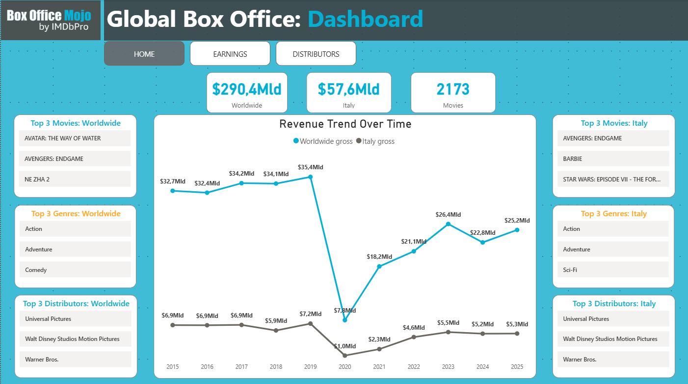
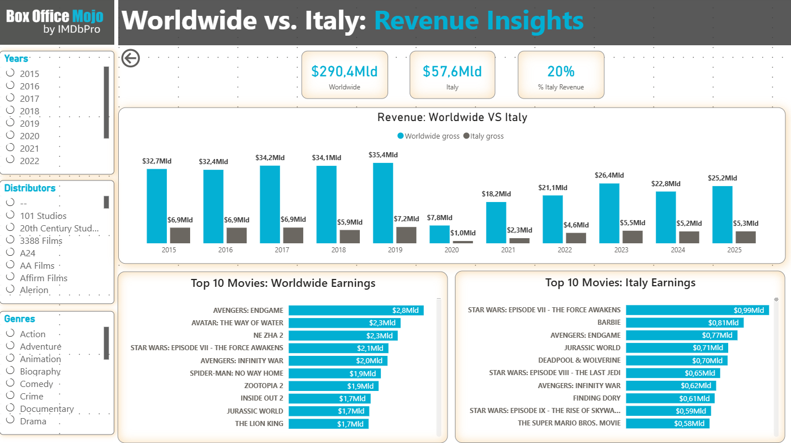
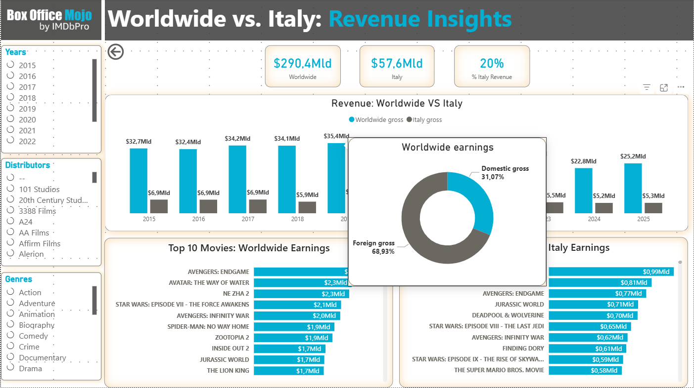
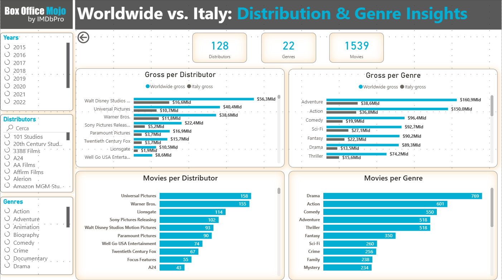

🎬 Global Box Office: End-to-End Data Pipeline & Analytics
Un'analisi comparativa tra il mercato Mondiale e Italiano (2015-2025)

📌 Project Overview
Questo progetto di Capstone dimostra l'intero ciclo di vita del dato. Partendo dal Web Scraping di dati grezzi da Box Office Mojo, ho progettato un Database Relazionale in MySQL e realizzato una Dashboard interattiva in Power BI. L'obiettivo è analizzare l'andamento del cinema nell'ultimo decennio, confrontando i trend globali con quelli del mercato italiano.

🛠️ Tech Stack
Python: Beautiful Soup, Pandas, NumPy (Scraping & Data Cleaning).

MySQL: Progettazione schema E/R e popolamento database.

Power BI: Data Modeling, DAX, Data Visualization.

Excalidraw: Progettazione dell'architettura del database.

🏗️ L'Architettura del Progetto
1. Data Acquisition (Python & Web Scraping)
La sfida principale è stata lo Scraping di 3° Livello:

Livello 1: Estrazione delle classifiche annuali (2015-2025) per Worldwide e Italia.

Livello 2: Navigazione automatizzata verso la pagina specifica di ogni singolo film.

Livello 3: Accesso alla sezione dettagliata del film per recuperare metadati critici come Distributori e Generi.

Soluzione tecnica: Gestione dei blocchi di richiesta tramite iterazioni annuali e concatenazione dei dataset tramite Pandas.

2. Data Cleaning & Engineering
Il problema maggiore risiedeva nella natura "sporca" dei generi (spesso multipli per singolo film).

Normalizzazione: Ho isolato i generi unici e creato una Bridge Table per gestire la relazione Many-to-Many (M2M) tra Film e Generi, permettendo analisi granulari senza duplicazioni di valore negli aggregati.

Integrazione: Collegamento diretto Python-MySQL per il popolamento automatizzato delle tabelle.

3. Database Design (MySQL)
Ho progettato uno schema ottimizzato composto da 5 tabelle core:

fact_intgross & fact_itagross: Dati storici e incassi.

dim_movies: Tabella "pura" con i titoli unici.

dim_genres: Lista dei generi unici.

bridge_moviegenre: Tabella di snodo per l'analisi multidimensionale.

4. Data Visualization (Power BI)
Il report finale è strutturato su 3 livelli di analisi:

Home Dashboard: Confronto immediato dei KPI (Revenue WW vs ITA) e Top 3 dinamiche per Distributori e Generi.

Revenue Insights: Focus profondo sugli incassi con analisi temporale 2015-2025 e Top 10 per mercato.

Distribution & Genre Analysis: Analisi volumetrica per capire "chi" distribuisce e "cosa" preferisce il pubblico, separando il numero di film prodotti dal profitto generato.

📈 Key Insights & Challenges
Handling M2M Relationships: La gestione della Bridge Table in Power BI ha permesso di filtrare l'intero report per singolo genere, nonostante l'origine dato fosse una stringa complessa.

Data Consistency: La pulizia tramite Python ha garantito la coerenza tra i titoli presenti nelle classifiche diverse, normalizzando i nomi dei distributori.

🚀 Guida all'Utilizzo (How to Use)
Il progetto è stato concepito come un flusso di lavoro sequenziale che trasforma i dati web in insight visuali. Per replicare l'analisi o esplorare il funzionamento della pipeline, segui questi passaggi:

1. Setup dell'Ambiente e Dipendenze
È necessario un ambiente Python 3.x equipaggiato con i package per il data crawling e la manipolazione di dataset complessi.

Librerie richieste: BeautifulSoup4 per il parsing HTML, Pandas e NumPy per la strutturazione dei dati e mysql-connector-python per l'interfaccia con il DB.

Database: Un'istanza locale attiva di MySQL Server.

2. Inizializzazione del Database Relazionale
Prima dell'esecuzione dello script di scraping, occorre predisporre il layer di persistenza dei dati:

Eseguire lo script SQL fornito nel repository per inizializzare lo schema.

Lo script genererà automaticamente le tabelle normalizzate e le foreign key necessarie a garantire l'integrità referenziale tra le entità (film, generi e classifiche).

3. Esecuzione della Pipeline ETL
Il processo di estrazione e caricamento è gestito dallo script principale, che implementa una logica di scraping ricorsivo a tre livelli:

Configurare le credenziali di accesso al database (Host, User, Password) nelle variabili di connessione del file Python.

Avviare lo script per far partire l'iterazione sulle directory annuali (2015-2025).

Lo script gestisce autonomamente il flusso di richieste per evitare l'overload dei server, eseguendo il parsing dei metadati e il caricamento transazionale direttamente su MySQL.

Nota: I dati vengono estratti dinamicamente dallo script Python e caricati direttamente nel database locale. I file CSV intermedi non sono inclusi nel repository per mantenere la struttura snella, ma vengono generati automaticamente durante l'esecuzione.

4. Connessione e Refresh del Report Power BI
Una volta completato il popolamento del database, il report è pronto per l'analisi:

Aprire il file .pbix.

Il modello dati è pre-configurato per il querying verso il database locale. È sufficiente aggiornare i parametri di connessione (Origine Dati) con le proprie credenziali locali.

Eseguire un Refresh globale: Power BI importerà i dati aggiornati tramite il connettore MySQL, popolando istantaneamente le dashboard interattive e le misure DAX.

### 🗄️ Database Architecture

   
  <strong>Entity-Relationship Model (Excalidraw)</strong> 
  

## 🖼️ Report Gallery

|
| 
|
|

